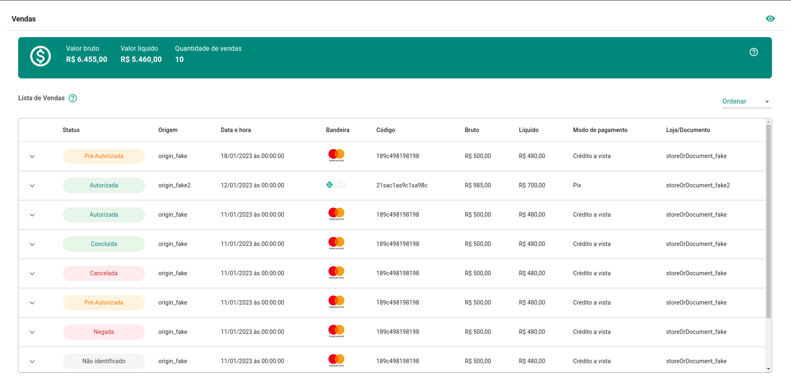
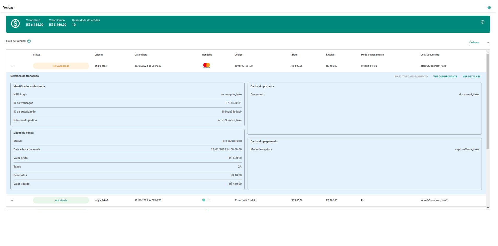
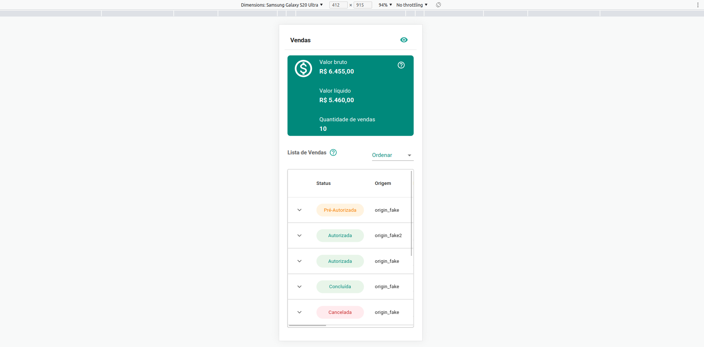

# Vendas

Repositório: [https://github.com/Gabrielg2d2/sales](https://github.com/Gabrielg2d2/sales)

Publicado (Vercel): [https://sales-rho.vercel.app/](https://sales-rho.vercel.app/)

Desktop:





Mobile:



**Descrição:**

Nesse projeto optei em aplicar DDD. Com isso podemos facilmente escalar o projeto, inclusive algumas funções que apliquei, apesar de simples, podem escalar complexidade no futuro.

Além disso, com a regra de negócio apartada da UI, temos o pode de migrar para diferentes frameworks, como React-Native, Vue entre outros, no mesmo contexto da stack de javascript.

Para configuração do projeto, usei o create-react-app, não vejo a necessidade de configurar o Webpack nesse caso.

Usei o Jest e Testing-library como sugerido, são duas libs que costumo usar nos meus projetos.

Configurei o Jest para 2 tipos de ambiente. Testes unitários, testes de integração, vou deixar os comandos abaixo, para facilitar o entendimento.

Um detalhe, sobre o teste de integração, não gosto da ideia de bater na api real, mas deixei dessa forma, para mostrar meu entendimento, geralmente uso um stub, que também apliquei nesse caso.

Para a UI, escolhi o material-ui, já que facilmente atenderia a aparência proposta, além de ter grande familiaridade, já que trabalhei nos últimos 3 anos com material, em 90% dos projetos.

Como boas práticas, para organização do código e controle dos commits, escolhi algumas libs que uso diariamente.

- Husky
- Linter-staged
- Prettier
- Eslint
- Editor-config

Sobre a organização de pasta do projeto. Usei um padrão próprio, algo que aplico em todos os projetos possíveis que inicio, mas claro, pode ser combinado por equipe, projeto, etc.

O que pode chamar a atenção, são as pastas pages e template.

Gosto de ter a pasta pages, para facilitar quando uso um context (provider), ou algum parâmetro que quero passar globalmente de forma simples.

Regras do projeto:

Para somar o valor bruto, líquido e quantidade, usei uma função do lado da ui, com "reducer", acredito que isso pode variar e fazer mais sentido retornar da api em alguns casos, mas para o fim desse projeto e demonstrar conhecimento optei por essa forma.

Já no caso de ordenar, como a paginação não foi determinada, optei por ordenar através da api.

Três pontos que devido ao tempo não consegui implementar. paginação e ação nos demais botões.
O terceiro ponto, seria usar o "React Query", para melhorar a experiência do usuário.

**SCRIPTS**

commit:

```tsx
npm run commit
```

Testes unitários:

```tsx
npm run test:unit

npm run test:unit:watch
```

Testes de integração:

```tsx
npm run test:integration

npm run test:integration:watch
```

Todos os testes:

```tsx
npm run test

npm run test:watch

npm run test:cov
```

Levantar o projeto, após clonar o repositório:

```tsx
npm run start
```
